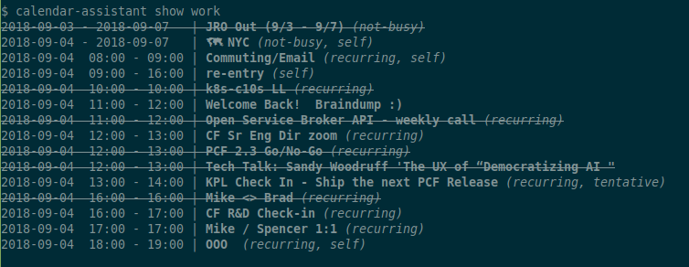
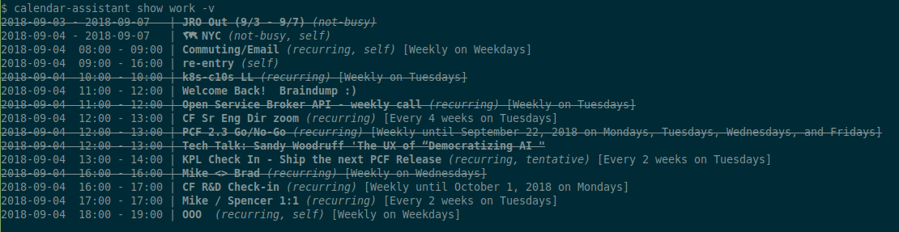
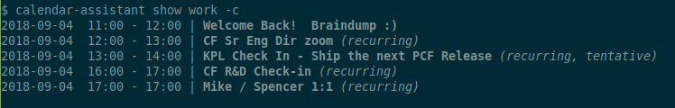

# calendar assistant

A command-line tool to help me book (and re-book) one-on-ones and other meetings automatically.


## Usage

Head to https://developers.google.com/calendar/quickstart/ruby to enable the Calendar API for your account and create a new project. Save the project info in `credentials.json`.

Then run `calendar-assistant authorize <profile-name>` (see below for details).


## Features

### Pretty Display

Events are nicely formatted, with strikeouts for events you've declined, and some additional attributes listed when present (e.g., "needsAction", "self", "not-busy", ....)

Event "recurrence rules" are expressed in plain english like "Every 2 weeks on Tuesdays", thanks to [Ice Cube](https://github.com/seejohnrun/ice_cube).


### Date and Time Specification

All dates and times are interpreted by [Chronic](https://github.com/mojombo/chronic) and so can be fuzzy terms like "tomorrow", "tuesday", "next thursday", and "two days from now" as well as specific dates and times.

For a date range or a datetime range, split the start and end with `...` like "tomorrow ... three days from now" or "2018-09-24...2018-09-27".


### Commands

#### Authorize access to your Google Calendar

``` bash
calendar-assistant authorize <profile-name>
```

This command will generate a URL which you should load in your browser while logged in as the Google account you wish to authorize. Generate a token, and paste the token back into `calendar-assistant`. The refresh token will be written to `calendar_tokens.yml`, which you should be careful not to share or make public.


#### Display your calendar events

``` bash
calendar-assistant show [-v] [-c] <profile-name> [<datespec>]
```

The `-v` ("--verbose") option will display additional event information, including recurrence rules.

The `-c` ("--commitments") option will omit events that you haven't accepted (either "yes" or "maybe") and that are with at least one other person.

For example:

_calendar-assistant show work_



_calendar-assistant show work -v_



_calendar-assistant show work -c_




#### Tell people where you are at in the world

Declare your location as an all-day non-busy event:

``` bash
calendar-assistant location set <profile-name> <location-name> [<datespec>]
```

**Note** that you can only be in one place at a time, so existing location events may be modified or deleted when new overlapping events are created.

Some examples:

``` bash
# create an event titled `🗺 WFH` for today
$ calendar-assistant location set work WFH
Created:
2018-09-03                | 🗺  WFH (not-busy, self)

# create an event titled `🗺 OOO` for tomorrow
$ calendar-assistant location set work OOO tomorrow
Created:
2018-09-04                | 🗺  OOO (not-busy, self)

# create an event titled `🗺 Spring One` on the days of that conference
$ calendar-assistant location set work "Spring One" 2018-09-24...2018-09-27
Created:
2018-09-24 - 2018-09-27   | 🗺  Spring One (not-busy, self)

# create a vacation event for next week
$ calendar-assistant location set work "Vacation!" "next monday ... next week friday"
Created:
2018-09-10 - 2018-09-14   | 🗺  Vacation! (not-busy, self)
```

#### Look up where you're going to be

``` bash
calendar-assistant location show [-v] <profile-name> [<datespec>]
```

For example:

``` bash
$ calendar-assistant location show work "today...next month"

2018-09-04 - 2018-09-07 | 🗺  NYC (not-busy, self)
2018-09-24 - 2018-09-27 | 🗺  Spring One @DC (not-busy, self)
2018-09-28              | 🗺  WFH (not-busy, self)
```

## The Future

Practing Readme-Driven-Development (RDD), some features I'd like to build are:

- ability to be busy for location events (e.g. vacation)
  - I'd like to test interaction between this and the OOO feature
- calendar "linter"
  - automatically decline 1:1s that were declined by the other person
  - prompt for action on upcoming unreplied-to events ("needsAction")
  - highlight events that are explicitly public, versus "calendar default"
  - indicate conflicts and prompt for resolution
- create variations on 1:1s
  - every N weeks for 30 minutes
  - every N weeks alternating 30 and 60 minutes
  - alternating 2:1 with 1:1s between two people
  - preference for start-of-day (breakfast) or end-of-day (pub)
  - one-time 1:1 within a time period
  - pool of people with repeating time slot(s) (e.g. all CF Eng managers)
- block off time when a day approaches full
  - optimize for big blocks of time
- mirror any flights I have from my Tripit calendar to my primary calendar
  - with 90 minute blocks before and after for travel to the airport, etc.

Also, I need to make this a real Ruby Gem so people can install it. :-\


## References

Google Calendar Concepts: https://developers.google.com/calendar/concepts/

Google's API docs: https://www.rubydoc.info/github/google/google-api-ruby-client/Google/Apis/CalendarV3

Recurrence: https://github.com/seejohnrun/ice_cube


## License

See files `LICENSE` and `NOTICE` in this repository.
